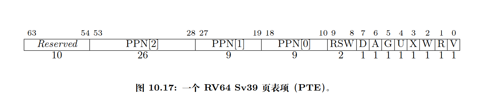

# 荣誉准则

1. 在完成本次实验的过程 (含此前学习的过程) 中，我曾分别与 **以下各位** 就 (与本次实验相关的) 以下方面做过交流，还在代码中对应的位置以注释形式记录了具体的交流对象及内容：

> 我没有与其他人交流过
2. 此外，我也参考了 **以下资料** ，还在代码中对应的位置以注释形式记录了具体的参考来源及内容：
> RISC-V 开放架构设计之道 1.0.0  (原著 The RISC-V Reader:  An Open Architecture Atlas)  大卫·帕特森 安德鲁·沃特曼 著  勾凌睿 陈璐 刘志刚 译  余子濠 包云岗 审阅  2023 年 12 月 13 日
> https://zh.wikipedia.org/wiki/%E5%86%85%E6%A0%B8%E9%A1%B5%E8%A1%A8%E9%9A%94%E7%A6%BB
4. 我独立完成了本次实验除以上方面之外的所有工作，包括代码与文档。 我清楚地知道，从以上方面获得的信息在一定程度上降低了实验难度，可能会影响起评分。

4. 我从未使用过他人的代码，不管是原封不动地复制，还是经过了某些等价转换。 我未曾也不会向他人 (含此后各届同学) 复制或公开我的实验代码，我有义务妥善保管好它们。 我提交至本实验的评测系统的代码，均无意于破坏或妨碍任何计算机系统的正常运转。 我清楚地知道，以上情况均为本课程纪律所禁止，若违反，对应的实验成绩将按 “-100” 分计

## 问答作业

###   请列举 SV39 页表页表项的组成，描述其中的标志位有何作用？

||                                                           |
| --- |-----------------------------------------------------------|
| V 位| 表示该 PTE 的其余字段是否有效(V=1 时有效)。若 V=0,则遍历到此 PTE 的虚拟地址翻译过程将触发页故障 |
| R、W、X 位 | 该页是否可读、可写、可执行,3 位均为 0,则该 PTE 指向下一级页表,否则为叶子节点 |                                            |
|U 位|该页是否为用户页|
|G 位|该映射是否存在于所有虚拟地址空间|
|A 位|自从上次清除 A 位以来,该页是否被访问过|
|D 位|自从上次清除 D 位以来,该页是否被写入过|
|RSW 字段| 保留给操作系统使用,硬件将忽略该字段|

###  缺页

缺页指的是进程访问页面时页面不在页表中或在页表中无效的现象，此时 MMU 将会返回一个中断， 告知 os 进程内存访问出了问题。os 选择填补页表并重新执行异常指令或者杀死进程。

- 请问哪些异常可能是缺页导致的？

> - Exception::StoreFault 
> - Exception::StorePageFault
> - Exception::LoadFault
> - Exception::LoadPageFault

- 发生缺页时，描述相关重要寄存器的值，上次实验描述过的可以简略。

  | 寄存器      | 作用                                              |
  |----------|-------------------------------------------------|
  | scause   | 指示发生了何种异常                                       |
  | stval    | 存放当前自陷相关的额外信息,如地址异常的 故障地址、非法指令异常的指令,发生其他异常时其值为 0 | 
  | stvec    | 存放发生异常时处理器跳转的地址         |
  | sstatus  | 执行 sret指令时，根据 sstatus 的 SPP 字段设置 CPU 特权级为 U 或者 S |
  | sepc     | 执行 sret指令时， 会将其值赋值给 PC 寄存器                      |
  | sscratch | 陷入之前任务的栈指针                                      |
  | satp     | 页表地址                                            |

缺页有两个常见的原因，其一是 Lazy 策略，也就是直到内存页面被访问才实际进行页表操作。 比如，一个程序被执行时，进程的代码段理论上需要从磁盘加载到内存。但是 os 并不会马上这样做， 而是会保存 .text 段在磁盘的位置信息，在这些代码第一次被执行时才完成从磁盘的加载操作。

- 这样做有哪些好处？
> 节省内存资源，提高使用率，节省IO等不必要的操作提升执行速度，运行更多的任务

其实，我们的 mmap 也可以采取 Lazy 策略，比如：一个用户进程先后申请了 10G 的内存空间， 然后用了其中 1M 就直接退出了。按照现在的做法，我们显然亏大了，进行了很多没有意义的页表操作。

- 处理 10G 连续的内存页面，对应的 SV39 页表大致占用多少内存 (估算数量级即可)？
> 三级页表项数目为
>   $$10GB/4KB  = 10\times 2^{18}\times 4KB / 4KB = 10\times 2^{18}$$
> 每个页表项占用 8 字节，所以三级页表项总大小为
> $$ 10\times 2^{18} * 2^3 B = 10 * 2 * 2^{20} B = 20 MB$$
> 二级页表项数目为
>  $$ 10\times 2^{18} / 2^9  = 10 * 2^9$$
> 每个页表项占用 8 字节，所以二级页表项总大小为
>  $$ 10\times  2^9 \times 2^3 B   =  10 * 2^{12} B = 20 KB$$
> 一级页表数目为
>  $$ 10\times 2^9 / 2^9 =  10 $$
> 每个页表项占用 8 字节，所以一级页表项总大小为
>  $$ 10\times 2^3 B   =  80B$$
> 总内存大小为
> $$ 20MB + 20KB + 80B  = 20.02008MB $$
> 

- 请简单思考如何才能实现 Lazy 策略，缺页时又如何处理？描述合理即可，不需要考虑实现。
> 对 `MemorySet`的 `MapArea`进行修改，记录申请的区间，不实际进行分配，用到的时候在进行实际页帧的分配

缺页的另一个常见原因是 swap 策略，也就是内存页面可能被换到磁盘上了，导致对应页面失效。

- 此时页面失效如何表现在页表项(PTE)上？
> 通过 RSW 字段 进行标记

### 双页表与单页表

为了防范侧信道攻击，我们的 os 使用了双页表。但是传统的设计一直是单页表的，也就是说， 用户线程和对应的内核线程共用同一张页表，只不过内核对应的地址只允许在内核态访问。 (备注：这里的单/双的说法仅为自创的通俗说法，并无这个名词概念，详情见 KPTI )

- 在单页表情况下，如何更换页表？
> 更新 stap 寄存器，清理指令缓存

- 单页表情况下，如何控制用户态无法访问内核页面？（tips:看看上一题最后一问）
> 设置页表项的 U 位，控制页表的访问权限

- 单页表有何优势？（回答合理即可）
> TLB 缓存不用清理，速度快

- 双页表实现下，何时需要更换页表？假设你写一个单页表操作系统，你会选择何时更换页表（回答合理即可）？
>  - S 态 与 U 态 切换时
>  - 对于单页表 OS，仅在进程切换时更换页表，并用 U 位来控制访问权限。